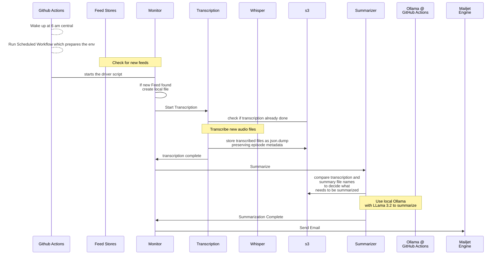

```mermaid
sequenceDiagram
    participant actions as Github Actions
    participant feeds as Feed Stores
    participant m as Monitor
    participant t as Transcription
    participant w as Whisper
    participant s3 
    participant summ as Summarizer
    participant o as Ollama @ <br/>GitHub Actions

    participant mail as Mailjet <br/>Engine
    
    actions -->actions: Wake up at 6 am central
    actions -->actions: Run Scheduled Workflow which prepares the env
    Note over m, feeds: Check for new feeds
    actions ->m: starts the driver script
    m -> m: If new Feed found <br/> create local file
    
    
    m ->>t: Start Transcription
    t->s3: check if transcription already done
    Note over t, w: Transcribe new audio files
    t->>s3: store transcribed files as json.dump <br/>preserving episode metadata
    t->>m: transcription complete

      
    m->>summ: Summarize
    summ ->> s3: compare transcription and <br/>summary file names <br/>to decide what <br/> needs to be summarized
    Note over summ, o: Use local Ollama <br/> with LLama 3.2 to summarize
    summ ->> m: Summarization Complete
    m->>mail: Send Email

```